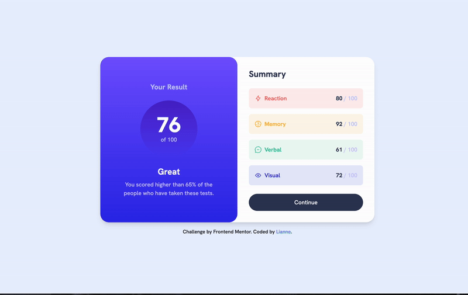

# Frontend Mentor - Results summary component solution

This is a solution to the [Results summary component challenge on Frontend Mentor](https://www.frontendmentor.io/challenges/results-summary-component-CE_K6s0maV). Frontend Mentor challenges help you improve your coding skills by building realistic projects.

## Table of contents

- [Frontend Mentor - Results summary component solution](#frontend-mentor---results-summary-component-solution)
  - [Table of contents](#table-of-contents)
  - [Overview](#overview)
    - [The challenge](#the-challenge)
    - [Screenshot](#screenshot)
    - [Links](#links)
  - [My process](#my-process)
    - [Built with](#built-with)
    - [What I learned](#what-i-learned)
  - [Author](#author)

## Overview

### The challenge

Users should be able to:

- View the optimal layout for the interface depending on their device's screen size
- See hover and focus states for all interactive elements on the page
- **Bonus**: Use the local JSON data to dynamically populate the content

### Screenshot

### Links

- Solution URL: [Add solution URL here](https://www.frontendmentor.io/solutions/a-responsive-result-page-with-animation-using-reactjs-and-tailwincss-2wfI6Ro3JX)
- Live Site URL: [Add live site URL here](https://results-summary-component-ten-eta.vercel.app/)

## My process

### Built with

- Semantic HTML5 markup
- CSS custom properties
- Flexbox
- CSS Grid
- Mobile-first workflow
- [React](https://reactjs.org/) - JS library
- [Next.js](https://nextjs.org/) - React framework
- [TailwindCSS](https://tailwindcss.com/) - For styles

### What I learned

- React Hooks: I learned how to use the useState hook to manage component state.
- Responsive Design: I implemented a responsive layout using Tailwind CSS classes, adapting the design for both mobile and desktop views.
- CSS Animations: I used CSS transitions to create a smooth reveal effect for the result section.
- External Libraries: I integrated the react-countup library to create animated number counters, enhancing the user experience.
- Dynamic Rendering: I used the map function to dynamically render summary items based on an array of data.

## Author

- Website - [Lianne](https://github.com/erath-rise)
- Frontend Mentor - [@lianne](https://www.frontendmentor.io/profile/erath-rise)
